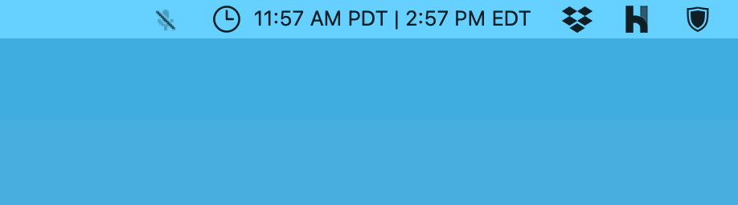
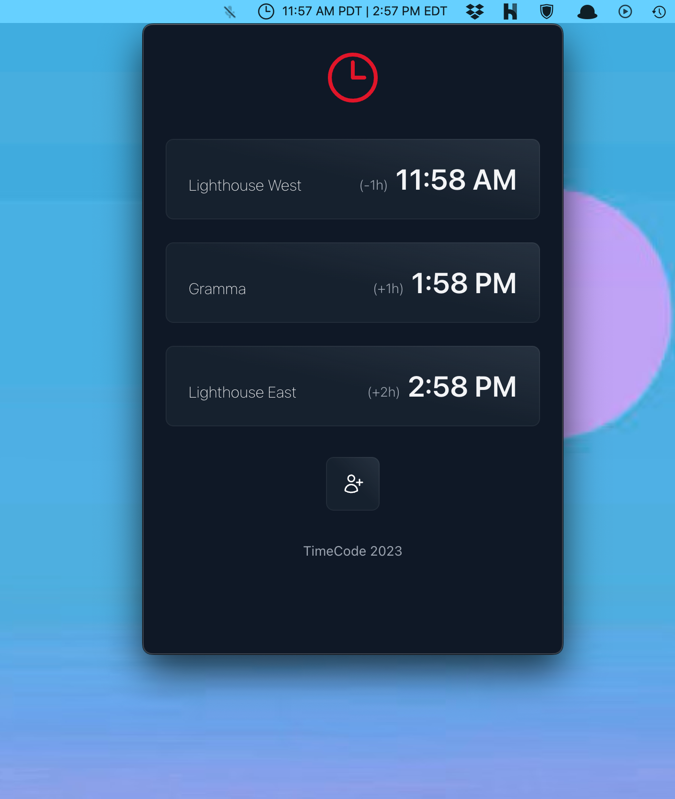
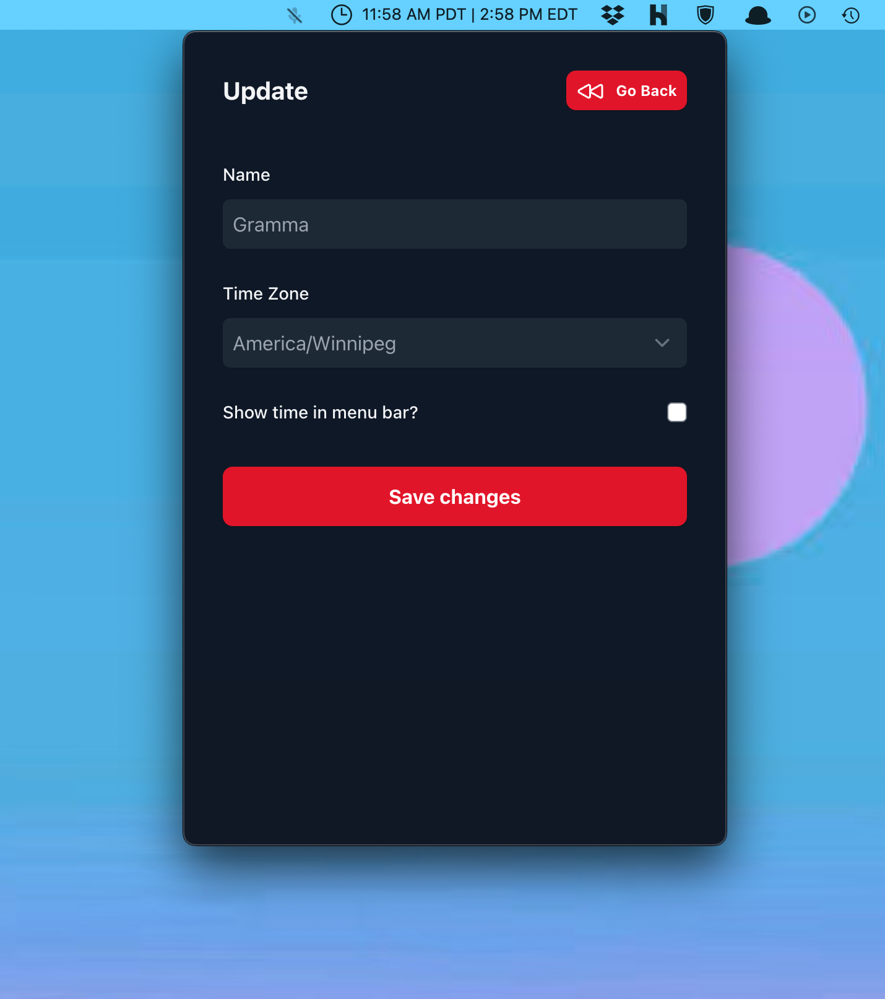

# TimeCode

TimeCode is a wonderfully simple macOS app built with [Laravel](https://www.laravel.com)
and [NativePHP](https://www.nativephp.com) that lets you monitor the time in other timezones on your Menu Bar.

## The why

Do you have a teammate who works remotely and want to respect their private time? Add them to TimeCode so you don't
annoy them outside of their normal working hours.
Are you taking an online course but the instructors only provide lecture times in their local time? Add them to TimeCode
and
never miss another presentation on giraffes.

## The how

TimeCode is fully customizable. Maybe you want to track more friends in different timezones but don't need it
constantly showing in the menu bar (screen real estate isn't free!)  Each timezone can be individually configured to
show (or not) in your menu bar for whatever setup suits you best. Add as many or as few different zones as you want -
you're in control!

## Screenshots

### Menu Bar

### Main screen

### Edit screen

## Contributions

Contributions are very welcome, whether in the form of PR, failing test, or just a suggestion on this repo.

## Credits / Inspiration

My original idea came from a similar app I used to use called
[Menu World Time](https://apps.apple.com/ca/app/menu-world-time/id1446377255?mt=12) and wanting to try out
NativePHP. TimeCode felt like a perfect way to dip my toe in the NativePHP water.

Shortly after the idea came to me, I saw a [tweet](https://twitter.com/christophrumpel/status/1688615450920284166?s=20)
from Christoph Rumpel who mentioned he was working on the same idea (validation, yay!)

Finally, I had seen a post on [laravel-news.com](https://laravel-news.com/nativephp-tutorial) going deeper and
simplifying some of the things I was trying to do.

This app is kind of an amalgamation of all of those sources, along with some of my own work added on.
